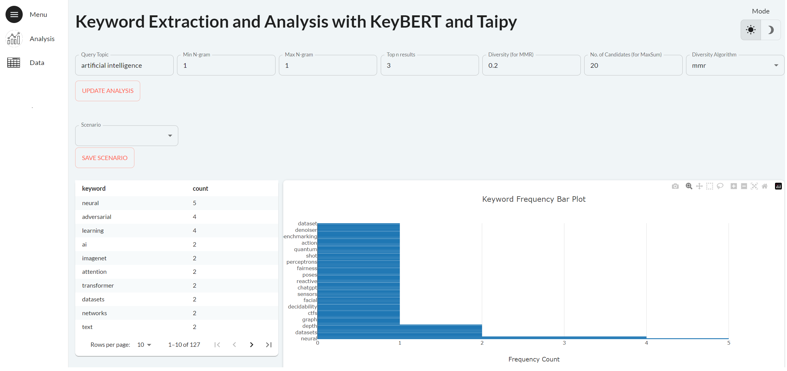

# Keyword Extraction Pipeline and Application with KeyBERT and Taipy
___
- To launch the application, run `python main.py` in your CLI
- Link to TowardsDataScience article for the step-by-step guide: https://towardsdatascience.com/arxiv-keyword-extraction-and-analysis-pipeline-with-keybert-and-taipy-2972e81d9fa4
 

___

## Context
- As the amount of textual data from sources like social media, customer reviews, and online platforms continues to grow exponentially, it is important that we are able to make sense of this unstructured data. 
- Keyword extraction and analysis are powerful natural language processing (NLP) techniques that enable us to achieve that.
- Keyword extraction involves automatically identifying and extracting the most relevant words from a given text, while keyword analysis involves analyzing the keywords to gain insights into the underlying patterns.
- In this project, we explore building a keyword extraction and analysis pipeline and web app on arXiv abstracts using the powerful tools of KeyBERT and Taipy.

___

## Components
- arXiv API Python wrapper: For the retrieval of arXiv abstracts
- KeyBERT: For keyword extraction from abstract texts
- Taipy Core: For building backend pipeline
- Taipy GUI: For building frontend user interface
___

## References
- https://maartengr.github.io/KeyBERT/api/keybert.html
- https://docs.taipy.io/en/latest/  
- https://www.ncbi.nlm.nih.gov/pmc/articles/PMC9202614/
- https://towardsdatascience.com/enhancing-keybert-keyword-extraction-results-with-keyphrasevectorizers-3796fa93f4db
